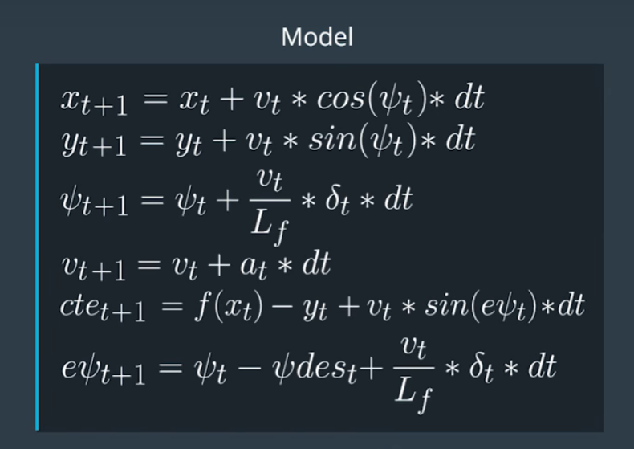
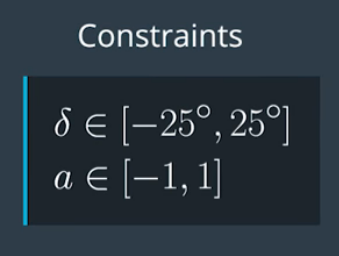
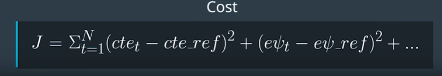

# CarND-Controls-MPC

In this project We are implementing Model Predictive Control to drive the car around the track framing the control problem as an optimizationo problem over time horizons. Cross track error are not given and we will need to caculate it our self. there's a 100 millisecond latency between actuations commands on top of the connection latency.


## Results 

Here are a sample video demonstrating a car driving in the autonomous mode using the MPC controller

<a href="http://www.youtube.com/watch?feature=player_embedded&v=gvES4oQ4Afg" target="_blank"></a>


## The Model
The model predictive controller (MPC) takes the current state vector as an input and uses model constraints and cost function along with the optimization solver to return a vector of control inputs that minimize the cost function. 

### State Vector

Below is description of state vector prameters

```
          double px = j[1]["x"];                        // Vehicle position in X direction
          double py = j[1]["y"];                        // Vehicle position in Y direction (lateral)
          double psi = j[1]["psi"];                     // Vehicle orientation 
          double v = j[1]["speed"];                     // Vehicle speed
          double delta = j[1]["steering_angle"];        //  Steering angle
          double acceleration = j[1]["throttle"];       // Accellration
          double cte;                                   // Cross track error
          double epsi;                                  // Orientation Error
```

### Update Equations
Kinematic models are simplifications of dynamic models that ignore tire forces, gravity, and mass.This simplification reduces the accuracy of the models, but it also makes them more tractable. At low and moderate speeds, kinematic models often approximate the actual vehicle dynamics.

Below are the global kinematic model equations developed to determine the next state (state at t+1) from our state vector at t and our actuator values. 




### Constraints




### Cost



### Setup 

- Define the duration of th trajectory by defining N and dt
- Define the Vehicle model 
- Define the Vehicle model constraints
- Define the compontents of the cost function

### The MPC state Feedback loop
- Translate the waypoints from Map to vehicle coordinates.
- Fit the polynomial to the waypoints.
- Calculate initial cross track error and oriantation error values.
- pass current state vector to the predictive controller. 
- Next the optimization solver is called (MPC::Solve). the solver (IPOPT) uses the initial state the model constraints and the cost function to return a vector of control inputs the minimize the cost function.
- Apply the first control input to the vehicle and repeat the loop.
- Return the waypoint trajector vectors for MPC control and reference trajectories to visualize the green and yellow lines.


## MPC Model tuning parameters:

### Timestep Length and Elapsed Duration (N & dt)

I tried to tune the hyperparameters, number of Timesteps (N) and duration (dt) according to the provided guidlines, where N should be set as large as possible and dt is set as small as possible 
 - N = 20 and dt = 0.1
 - N = 15 and dt = 0.1
- N = 10 and dt = 0.1
- N = 10 and dt = 0.05
- N = 10 and dt = 0.01
In general I noticed that N values greater than 15 causes the car to drive unpredictablely especailly across curvatures. I'm assuming that caused by the computational cost added by increasing N which in turns add additional latency. I settle on choosing N=10 and dt=0.1.


### Model predictive control with latency

Latency can be caused by many reasons one of which is actuator dynamics. which means that actuation command won't execute instantly. In order to account for the synthetic latency introduced by the simulator, I first tried to calculate the next state using the update equations before sending it to the solver. and finally restorted into fixing dt=dt+0.1 while calculting the projected state in the model equations. The car can drive fine based on the  the rubric conditions up to 80 mph. The above approaches were recommended in the community Q&A. however i'm pretty sure there is an area to improve the way i handled latency in my solution.


## Dependencies

* cmake >= 3.5
 * All OSes: [click here for installation instructions](https://cmake.org/install/)
* make >= 4.1(mac, linux), 3.81(Windows)
  * Linux: make is installed by default on most Linux distros
  * Mac: [install Xcode command line tools to get make](https://developer.apple.com/xcode/features/)
  * Windows: [Click here for installation instructions](http://gnuwin32.sourceforge.net/packages/make.htm)
* gcc/g++ >= 5.4
  * Linux: gcc / g++ is installed by default on most Linux distros
  * Mac: same deal as make - [install Xcode command line tools]((https://developer.apple.com/xcode/features/)
  * Windows: recommend using [MinGW](http://www.mingw.org/)
* [uWebSockets](https://github.com/uWebSockets/uWebSockets)
  * Run either `install-mac.sh` or `install-ubuntu.sh`.
  * If you install from source, checkout to commit `e94b6e1`, i.e.
    ```
    git clone https://github.com/uWebSockets/uWebSockets
    cd uWebSockets
    git checkout e94b6e1
    ```
    Some function signatures have changed in v0.14.x. See [this PR](https://github.com/udacity/CarND-MPC-Project/pull/3) for more details.

* **Ipopt and CppAD:** Please refer to [this document](https://github.com/udacity/CarND-MPC-Project/blob/master/install_Ipopt_CppAD.md) for installation instructions.
* [Eigen](http://eigen.tuxfamily.org/index.php?title=Main_Page). This is already part of the repo so you shouldn't have to worry about it.
* Simulator. You can download these from the [releases tab](https://github.com/udacity/self-driving-car-sim/releases).
* Not a dependency but read the [DATA.md](./DATA.md) for a description of the data sent back from the simulator.


## Basic Build Instructions

1. Clone this repo.
2. Make a build directory: `mkdir build && cd build`
3. Compile: `cmake .. && make`
4. Run it: `./mpc`.

## Build with Docker-Compose
The docker-compose can run the project into a container
and exposes the port required by the simulator to run.

1. Clone this repo.
2. Build image: `docker-compose build`
3. Run Container: `docker-compose up`
4. On code changes repeat steps 2 and 3.

## Tips

1. The MPC is recommended to be tested on examples to see if implementation behaves as desired. One possible example
is the vehicle offset of a straight line (reference). If the MPC implementation is correct, it tracks the reference line after some timesteps(not too many).
2. The `lake_track_waypoints.csv` file has waypoints of the lake track. This could fit polynomials and points and see of how well your model tracks curve. NOTE: This file might be not completely in sync with the simulator so your solution should NOT depend on it.
3. For visualization this C++ [matplotlib wrapper](https://github.com/lava/matplotlib-cpp) could be helpful.)
4.  Tips for setting up your environment are available [here](https://classroom.udacity.com/nanodegrees/nd013/parts/40f38239-66b6-46ec-ae68-03afd8a601c8/modules/0949fca6-b379-42af-a919-ee50aa304e6a/lessons/f758c44c-5e40-4e01-93b5-1a82aa4e044f/concepts/23d376c7-0195-4276-bdf0-e02f1f3c665d)
5. **VM Latency:** Some students have reported differences in behavior using VM's ostensibly a result of latency.  Please let us know if issues arise as a result of a VM environment.

## Editor Settings

We have kept editor configuration files out of this repo to
keep it as simple and environment agnostic as possible. However, we recommend
using the following settings:

* indent using spaces
* set tab width to 2 spaces (keeps the matrices in source code aligned)

## Code Style

Please (do your best to) stick to [Google's C++ style guide](https://google.github.io/styleguide/cppguide.html).

## Project Instructions and Rubric

Note: regardless of the changes you make, your project must be buildable using
cmake and make!

More information is only accessible by people who are already enrolled in Term 2
of CarND. If you are enrolled, see [the project page](https://classroom.udacity.com/nanodegrees/nd013/parts/40f38239-66b6-46ec-ae68-03afd8a601c8/modules/f1820894-8322-4bb3-81aa-b26b3c6dcbaf/lessons/b1ff3be0-c904-438e-aad3-2b5379f0e0c3/concepts/1a2255a0-e23c-44cf-8d41-39b8a3c8264a)
for instructions and the project rubric.

## Hints!

* You don't have to follow this directory structure, but if you do, your work
  will span all of the .cpp files here. Keep an eye out for TODOs.

## Call for IDE Profiles Pull Requests

Help your fellow students!

We decided to create Makefiles with cmake to keep this project as platform
agnostic as possible. We omitted IDE profiles to ensure
students don't feel pressured to use one IDE or another.

However! I'd love to help people get up and running with their IDEs of choice.
If you've created a profile for an IDE you think other students would
appreciate, we'd love to have you add the requisite profile files and
instructions to ide_profiles/. For example if you wanted to add a VS Code
profile, you'd add:

* /ide_profiles/vscode/.vscode
* /ide_profiles/vscode/README.md

The README should explain what the profile does, how to take advantage of it,
and how to install it.

Frankly, I've never been involved in a project with multiple IDE profiles
before. I believe the best way to handle this would be to keep them out of the
repo root to avoid clutter. Most profiles will include
instructions to copy files to a new location to get picked up by the IDE, but
that's just a guess.

One last note here: regardless of the IDE used, every submitted project must
still be compilable with cmake and make./

## How to write a README
A well written README file can enhance your project and portfolio and develop your abilities to create professional README files by completing [this free course](https://www.udacity.com/course/writing-readmes--ud777).
